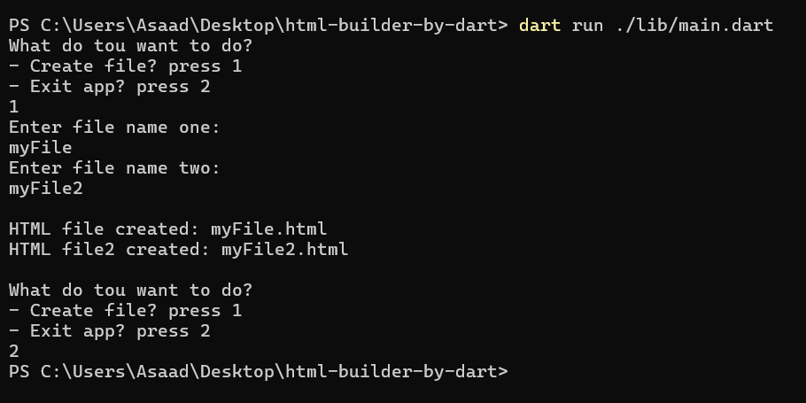
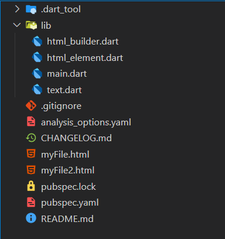

# Dart HTML Builder 🧱

A web page builder project developed using the **Dart** programming language.

---

## 📄 Project Description

This project is a **Dart-based Web Page Builder** that allows you to dynamically create and style HTML components through Dart code. It was built to meet the requirements provided in the assignment and showcases a modular and reusable component-based architecture.

---

## ✅ Features

- 🧩 **20+ Custom HTML Components**  
  Custom components such as headings, paragraphs, images, links, tables, lists, forms, buttons, and more.

- 🎨 **Styling Support for 15+ CSS Styles**  
  Including color, font size, padding, margin, border, alignment, background, width, height, text decoration, and more.

- 📁 **Organized File Structure**
  - All components are placed either in a single file (`html_builder.dart`) or split into separate files.
  - `main.dart` contains the entry point and demonstrates usage by generating two different HTML pages.

---

## 🛠️ Technologies Used

- **Dart SDK**
- **HTML Generation via Dart**
- **Object-Oriented Programming**

---

## 📸 Screenshots

---

## 🚀 How to Run

Make sure Dart SDK is installed. Then:

`dart run ./lib/main.dart`

---

## 📌 Requirements Fulfilled

1. Created at least 20 components
2. Implemented 15+ styling options
3. Used either single file or multiple files for components
4. main.dart is in a separate file
5. Generated two HTML pages in the main method
6. Submitted as a compressed folder named with my full name

## 👨‍💻 Developer

- _Name_: [Asaad Hayani]
- _Email_: [asaad99hayani@gmail.com]
- _GitHub_: [github.com/AsaadHayani]

---

## 📄 License

This project is open-source and available under the [MIT License](LICENSE).
هل هذا المحتوى صحيح؟
